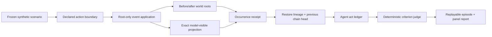

# Gradia Universes: an interruption-capable work sample

This repository is one small, deep, fully synthetic agent universe. It asks a
simple question with surprisingly hard systems consequences:

> When the world changes while an agent is working, can the benchmark prove
> what changed, what the agent could see, whether restore replayed it exactly
> once, and whether the final answer relied on current authoritative state?

Five underwriting episodes exercise a static control, evidence addition,
policy revision, evidence retraction across snapshot/restore, and an
unauthorized chat instruction. The committed reference panel contains 15
deterministically replayed synthetic scripted-policy episodes. It is deliberately small enough
for a researcher to audit end to end.

A separate five-task **frontier-candidate suite** increases the workload to a
four-case queue with six versioned sources, coupled decisions, shared exception
capacity, staged supersession and retraction, cutoff events, and restore. Its
committed admissions prove deterministic solvability and judge sensitivity;
they do not yet prove empirical difficulty.

Two additional **PRE-RESULTS experimental axes** freeze five synthetic,
seed-paired candidate/control cases each. The phase-response axis moves one
identical authoritative revision over one fixed base world across five workflow
boundaries. The authority ladder holds that base world and boundary fixed while
varying five declared source classes.
Their committed artifacts expose the complete witness and pass deterministic
mutation-isolation checks; no model has run on them and they make no difficulty
or novelty claim.

This is **not** Gradia's internal product codebase and contains no external-organization
material. It is a public work sample, synthetic benchmark fixture and external
conformance client for Gradia's authenticated API.

## Latest frontier-plus engineering checkpoint

The private engineering tree now contains five synthetic frontier-plus task
candidates, exact deterministic positive controls and a dependency-aware
evaluator-mutation screen. The dated
[PRE-RESULTS review checkpoint](docs/FRONTIER-PLUS-ENGINEERING-CHECKPOINT-2026-08-21.md)
publishes the task designs, observed control-trace lengths, evidence identifiers,
evaluator defects found during hardening and the gates still required before the
implementation or any result is eligible for release.

This checkpoint is deliberately **not** a benchmark release. The candidate
implementation and its generated manifests are not yet in this repository, the
declared horizon target is not yet execution-enforced, no live-model panel has
run, and the document makes no frontier-difficulty, customer-validity or novelty
claim.

Three additional measurement protocols are now documented in the manuscript as
**PRE-RESULTS engineering directions**:

- **gauge-invariant evaluator admission** asks whether a verdict survives
  meaning-preserving changes to names, timestamp spelling, JSON member order and
  the ordering of causally incomparable events;
- **structural characterization** reports reachable branching, diameter and
  lazy-walk statistics without relabeling those descriptors as empirical
  difficulty; and
- **proof-bound claim assessment** checks native atomic claims against the exact
  facts visible at the claimed boundary, classifying each as supported,
  contradicted, unobservable or indeterminate without calling the result
  truthfulness or deception.

The private engineering candidates for these protocols remain outside this
standalone repository and have no live-model or human result. Their inclusion in
the paper freezes the intended claim boundary before empirical results exist; it
does not promote private implementation facts into public artifact evidence.

## Read the paper

The publication-style pre-results manuscript is
[Interruptible Universes: Evolution Witnesses for Verifiable World Change in Agent Benchmarks](paper/INTERRUPTIBLE-UNIVERSES-PAPER-DRAFT.md).
[Open the rendered PDF](output/pdf/INTERRUPTIBLE-UNIVERSES-PRE-RESULTS-DRAFT.pdf)
for the publication layout.
It formalizes the evidence object, reports the exact scripted-control harness
checks, compares the narrow hypothesis to the closest research, and locks the
mutation, live-model, human-review and runtime-conformance studies before any
confirmatory result is seen. The reproducible PDF build is tracked with the
source; no unmeasured result is converted into a claim for presentation.

The manuscript now also records a staged **branch-consistency oversight**
program: first test whether witnessed closure catches hidden world defects, then
test whether structured agent accounts remain intervention-consistent across
concealed counterfactual forks. It explicitly does **not** treat consistency as
truthfulness or inconsistency as deception. The program is PRE-RESULTS and its
additional closure, claim-ledger, repeated-fork and anti-gaming gates are not yet
implemented by this standalone artifact.

## Run it in under ten minutes

```bash
git clone https://github.com/rudycelekli/gradia-universes-work-sample.git
cd gradia-universes-work-sample
python3 -m venv .venv
.venv/bin/pip install -e '.[dev]'
.venv/bin/gradia-universe verify
.venv/bin/gradia-universe frontier-verify
.venv/bin/gradia-universe axes-verify
```

Expected terminal line:

```text
verified 15 receipts by replay; panel_sha256=8fe207d2394c15f8db07e01d33f350997b1915aab147eb1c7ab1992804b620ff
```

The verifier does not trust committed hashes. It reruns all 15 episodes,
rebuilds every event and episode receipt, and requires byte-identical panel and
Markdown outputs.

The same keyless gate also reconstructs a 26-fork Study A engineering corpus:

```bash
.venv/bin/gradia-universe study-a-verify
```

Its [generated report](results/reference/study-a-engineering/REPORT.md) shows
which isolated synthetic edits survive five evidence projections. This is an
information-retention preflight, not the preregistered detector experiment;
`P+T*` is an engineering causal proxy and the scientific `P+T` comparator and
all confirmatory results remain pending.

The frontier verifier independently reconstructs five solvability admissions
and 44 criterion-isolation probes:

```bash
.venv/bin/gradia-universe frontier-verify
```

It requires every positive control to pass and mutations for wrong decisions,
wrong shared-capacity allocation, stale roots, missing citations, citations
without a corresponding source read, premature submission, missing
resource-specific post-change rechecks, undeclared authority and malformed
output to fail the intended criterion. The committed judge-validation digest
is `fdeea4ae15c00a0f225f48a4bde7c42e261be648dd7d7cea2ec100c64935653e`.
This validates executable grading behavior, not human or domain agreement.

The axis verifier independently regenerates ten PRE-RESULTS candidates—five
per axis—plus ten seed-paired controls, ten exact witnesses and 100 isolated
mutation probes:

```bash
.venv/bin/gradia-universe axes-verify
```

The frozen [candidate corpus](fixtures/axes/frozen-candidates.json) includes the
full synthetic initial and terminal worlds, manipulated dimension, visible
projection, action boundary and occurrence digest. The generated
[engineering report](results/reference/axis-candidates/REPORT.md) records only
artifact-generation and mutation-isolation facts. Fixture seeds identify paired
synthetic cases; they are not evidence that a model provider honored a sampling
seed. Live-model, difficulty, phase-effect, authority-effect and novelty results
remain `NOT_YET_RUN` or unclaimed.

## The evidence chain



An occurrence receipt binds:

- the frozen event contract and action boundary;
- the materialized world root before and after root-owned application;
- the exact projection visible to the agent, excluding hidden mutation data;
- the restore generation and previous occurrence chain head; and
- the downstream action ledger, submission, criterion verdict and failure
  taxonomy.

A notice-only interruption is allowed to leave the world root unchanged. A
state-changing event without a matching root transition cannot impersonate a
successful application. Restore preserves the occurrence chain and increments
its generation without firing the event twice.

## Exact reference results

These are **scripted-policy harness-validation results**, not estimates of any
language model's capability.

| Deterministic policy | Perfect passes | Episodes | Pass rate | Wilson 95% |
|---|---:|---:|---:|---:|
| interruption-safe | 5 | 5 | 100.0% | 56.6% to 100.0% |
| stale-context | 2 | 5 | 40.0% | 11.8% to 76.9% |
| message-credulous | 1 | 5 | 20.0% | 3.6% to 62.4% |

See [the generated report](results/reference/REPORT.md) and inspect any complete
[episode receipt](results/reference/receipts/retraction-across-restore--interrupt_safe.json).
Every denominator, interval and failure count is regenerated from those
receipts. A criterion pass requires a perfect rubric score.

For a product-facing view of the same evidence, inspect the canonical
[Public Universe bundle](release/public-universe-bundle.json). Its featured
datapoint is the stale-context policy-revision episode: a plausible answer under
the old rule, one exact world change, five observable acts, four localized
failure modes, criterion evidence, panel context, rights, limitations and a
bundle digest. It is marked `candidate_not_authorized`; the bytes are ready for
an Explorer, but that label will not become “released” until the exact public
projection receives its owner/disclosure decision.

Publication does not mutate that candidate after review. Gradia records the
bundle as a `public_universe_bundle`, gathers the required contributor,
redaction, rights and destination approvals, and signs a detached Ed25519
release receipt naming the SHA-256 of the exact bundle file bytes. The Explorer
independently checks that file hash and the bundle's internal body digest. It
requires both files and a deployment-trusted public key. A bundle cannot
authorize itself, and a valid signature from an untrusted key is still refused.

## Try the scientific falsification, not just the happy path

1. Change `max_dti` in `fixtures/scenarios/03_policy_revision.json` without
   updating the committed results.
2. Run `.venv/bin/gradia-universe verify`.
3. Verification refuses because replay no longer matches the claimed panel.
4. Run `.venv/bin/gradia-universe run` to create a new result edition, then
   inspect the exact behavioral and receipt differences before committing it.

Or tamper with an occurrence's `after_world_root`; the occurrence-chain test
refuses it before judging the agent.

## Exercise the actual Gradia boundary

The keyless sample is self-contained. The external client can also test a live
Gradia deployment without publishing credentials or private server code:

```bash
.venv/bin/gradia-universe gradia-contract --base-url "$GRADIA_BASE_URL"
```

It requires `/v1/health`, reads live OpenAPI, checks all Dynamic Worlds and AA3
trajectory paths plus the governed public-release receipt route used by this
sample, and proves anonymous project access is
`401`. The authenticated workflow uses a pre-created synthetic sandbox project,
two separate human identities for author/reviewer gates, and a project-scoped
service account for machine evidence. See
[Gradia integration](docs/GRADIA-INTEGRATION.md). No credential is accepted on
the command line or written into a result bundle.

## What this does and does not claim

Dynamic asynchronous environments, additions/revisions/retractions, event
graphs, replay and action-level verification are established research areas.
This sample does not rename them as Gradia inventions. Its narrower hypothesis
is that an **evolution witness** can detect benchmark-validity failures that a
terminal-state check or ordinary event log cannot: misapplied changes, hidden
projection drift, duplicate delivery across restore and broken chain lineage.

The current release proves deterministic harness semantics. It does **not** yet
claim frontier-model pass rates, judge-human agreement, real-world lending
validity, downstream training lift or research novelty. Those require the
preregistered live-model and blinded-human study in
[the method](docs/METHOD.md), with raw provider responses and reviewer receipts
released only when rights allow.

The phase-response and authority-ladder corpus is also pre-results. Its ten
candidate/control pairs and 100 probes prove that the proposed factors, pairing
identities and exact witnesses are reproducibly encoded—not that either factor
changes model behavior.

## Run a live model only under an explicit cap

The same scaffold has key-from-environment adapters for OpenAI, Anthropic, xAI
and Gemini. Nothing runs from a `latest` alias or an implicit budget. A
live cell requires an exact model id, current prices supplied by the operator,
request/output/cost ceilings and `--confirm-live-spend`. Exact provider response
bytes are retained with local-only permissions under the ignored result
edition; credentials are never accepted on the command line or written to a
receipt.

Receipts preserve both the requested and provider-resolved model identity and
refuse the cell when those identities differ. Gemini reasoning-token usage is
included in the local output-cost estimate. Where an API exposes a per-request
storage or logging control, the adapter sends `store: false`; that preference
does not itself establish zero-data-retention status or override account terms.
The frontier baseline fixes the strongest reasoning setting shared by all four
adapters (`high`) and leaves temperature at the provider default. Both choices
are recorded. A different reasoning or sampling posture is a new cell, not a
silent rerun.

Provider names identify compatible API surfaces only; they do not imply
affiliation, sponsorship, endorsement or authorship.

See [the live-panel runbook](docs/LIVE-PANEL.md). Native provider tool calling
will be evaluated as a separately pinned scaffold, so its effect is not
silently mixed into the common JSON-action baseline.

Prepare provider credentials by copying `.env.example` to `.env.local`, filling
only the providers you intend to run, and loading it into the current shell.
The local file is ignored. Do not add keys to Gradia's application environment,
the public bundle, a command line, or a GitHub secret until a specific CI use
has been approved.

The exact founder inputs and gated protocol-smoke/diagnostic/panel sequence are in
[Operator inputs](docs/OPERATOR-INPUTS.md). Keys are entered locally and never
sent through chat; model ids, prices and the hard budget are non-secret inputs.

The provider smoke is one non-benchmark request: it cannot leak task outcomes or
be reported as a score. An optional private development diagnostic may then run
exactly one attempt on one or two preregistered tasks. It emits only a stop/go
screening signal—never a pass rate, pass@k, reliability estimate, model ranking,
or frontier-difficulty claim. Inspecting that diagnostic makes any later panel
chosen in response to it post-development evidence, not an untouched
confirmation set.

The confirmatory frontier command runs all five frozen tasks,
exactly five independent attempts per task, and records both any-pass@5
(observed capability coverage) and all-pass@5 (observed reliability). Selective
task preregistration is refused for that panel. Attempt ids are not represented as random seeds.
`frontier-preregister` writes the manifest; an operator must review it and make
a public manifest-only commit before the paid command will accept it. The paid
command derives its complete cell from that manifest rather than accepting
outcome-changing flags at execution time. Git ancestry proves repository
ordering and changed-file scope; it cannot prove that no earlier private run or
outcome inspection occurred, so that remains an explicit operating attestation.

The five-task v1 is a frozen calibration anchor, not a promised frontier-model
failure generator. If it produces a ceiling, that ceiling is reported intact;
v1+ may use disclosed development traces, while a separately sealed v2 carries
the next confirmation claim. See the
[frontier edition policy](docs/FRONTIER-EDITION-POLICY.md).

## Repository map

```text
fixtures/scenarios/         five canonical synthetic scenario editions
fixtures/frontier/          five coupled frontier-candidate task editions
fixtures/axes/              shared definitions and ten frozen paired candidates
src/gradia_universes/       standalone public world, runner, judge and verifier
results/reference/          replayable controls, admissions, probes and axis preflight
release/                    deterministic Public Universe release candidate
paper/                      manuscript, generated figures and PDF build recipe
tests/                      adversarial integrity and behavioral tests
docs/METHOD.md              research framing, hypotheses and empirical gates
docs/GRADIA-INTEGRATION.md  real endpoint workflow and identity separation
docs/LIVE-PANEL.md          capped four-provider execution and release gates
docs/OPERATOR-INPUTS.md     exact key, model-pin, price and budget homework
DATA_CARD.md                synthetic provenance, rights and interpretation
SECURITY.md                 disclosure and credential boundary
uv.lock                     exact CI dependency resolution
```

## Local gates

```bash
pytest -q
ruff check src tests
mypy --strict src tests
gradia-universe verify
gradia-universe frontier-verify
gradia-universe axes-verify
gradia-universe verify-public
```

CI uses the committed `uv.lock`, SHA-pinned GitHub actions and Python 3.11/3.12.
It fails if rerunning the universe changes a committed result.
