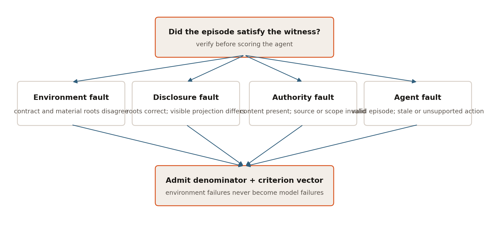
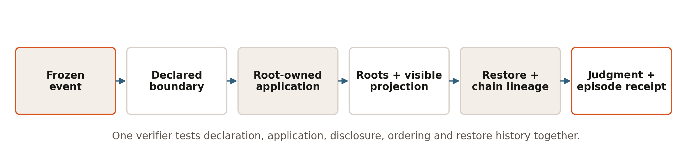
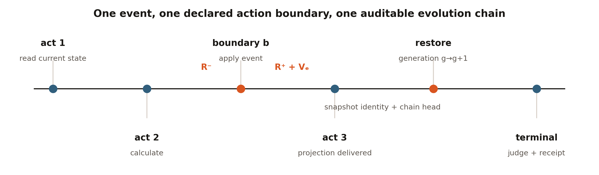

**Artifact license:** Apache-2.0 for the code and synthetic fixtures; live-model outputs remain subject to provider terms and a separate rights review.

## Abstract

Long-horizon agent benchmarks increasingly change the world while an agent works: evidence arrives, policies are superseded, sources are retracted, and runtimes restore from snapshots. A terminal state and an event log cannot establish that a declared change was applied at the declared action boundary, that the agent received exactly the declared projection, or that restore preserved exactly-once history. We introduce the **evolution witness**, a hash-bound evidence object composing the frozen event contract, application boundary, before/after material-world roots, agent-visible projection digest, restore generation, and previous occurrence head.

This composition separates four faults that terminal correctness conflates: environment application, disclosure, authority, and agent adaptation. We release a fully synthetic deterministic reference universe, replayable receipts, a keyless verifier, scripted controls, and isolated verifier mutations. We specify two preregistered studies: an externally grounded mutation study against terminal, log, milestone, and proof-of-execution-style evidence policies, including benign perturbations and minimal-sufficiency ablations; and an identity-bound live-model study of adaptation under pushed and pulled world change at varied action boundaries. The proposed contribution is not dynamic worlds, interruptions, provenance, or execution receipts in isolation. It is a benchmark-validity composition that makes declared world evolution, material application, disclosure, temporal boundary, restore lineage, and adjudication jointly testable.

> **Study status.** Scripted controls and mutation probes validate deterministic instrument behavior only. Confirmatory validity, live-model behavior, human agreement, real-world validity, training lift, causal attribution, provider parity, and novelty comparisons are preregistered or out of scope; Appendix A is the authoritative status registry.

## 1. Introduction

Agent benchmarks are becoming less like question sets and more like operating environments. An agent reads tools, writes state, waits for external events, handles interruptions, and eventually commits an answer or action. This is desirable: realistic work is stateful and open ended. It also creates a measurement problem that a terminal reward cannot solve by itself.

Consider an authority-conflict episode in the released reference world. An agent reaches the correct terminal recommendation but cites an unverified message as evidence. Terminal accuracy says *correct*; the evidence-aware judge scores 0.8 because the provenance failure is real. That one trace motivates the paper: correctness alone cannot tell whether the world applied a change correctly, disclosed it correctly, authorized it correctly, or whether the agent adapted correctly.



Suppose an environment declares that a policy was revised after the agent's second act. The final database may contain the revised policy. The log may contain a revision event. The agent may nevertheless have received a different message, received it after committing, or continued from a restored snapshot in which the revision fired twice. A correct terminal state cannot prove a correct trajectory, and an ordinary log cannot prove that the logged event corresponds to the material change, visible notice, or boundary the benchmark specification promised.

This distinction matters for both evaluation and training. If an invalid environment episode is scored as an agent failure, a leaderboard measures harness defects. If it is admitted into a training corpus, the reward signal may favor stale evidence, unauthorized instructions, or behaviors that exploit replay bugs. Conversely, an evidence system that rejects valid episodes too readily can make long-horizon evaluation impractical. The empirical question is therefore not whether more logging sounds useful. It is whether a particular evidence composition detects additional invalid episodes without unacceptable false rejection or cost.

The artifact in this repository turns that question into a falsifiable study. It provides a minimal world where all relevant state, events, observations, actions, restores, and judgments can be audited end to end. It deliberately avoids real records, non-public infrastructure, and organization-dependent claims. The synthetic domain supplies understandable state changes; it is not presented as a lending benchmark or policy.

### 1.1 Research questions

- **RQ1 -- Incremental validity.** Does the full witness detect externally grounded dynamic-world defects missed by terminal-state, ordinary-log, milestone, or proof-of-execution-style evidence, while accepting faithful episodes under benign re-projection?
- **RQ2 -- Minimal sufficiency.** Which witness fields are necessary for detection and localization, and what field set lies on the Pareto frontier of coverage, bytes, and verification latency?
- **RQ3 -- Behavioral adaptation.** How often do identity-bound live-model attempts adapt to pushed and pulled additions, revisions, retractions, and authority conflicts at varied action boundaries?
- **RQ4 -- Human utility.** In a separately powered study, do witnesses improve reviewers' detection and localization of invalid episodes relative to weaker evidence views?

### 1.2 Contributions

1. **Evidence object and fault attribution.** A canonical occurrence receipt joins the event contract, realized roots, exact visible projection, action boundary, restore generation, and prior chain head; the verifier attributes environment, disclosure, authority, and agent faults separately.
2. **Auditable reference instrument.** A fully synthetic universe, deterministic judge, replayable receipts, keyless verifier, scripted controls, and isolated mutation probes make every current engineering claim independently reproducible.
3. **Preregistered validity study.** An externally grounded defect corpus, benign metamorphic perturbations, proof-of-execution-style comparator, and component ablations test incremental detection, false rejection, localization, and the minimal sufficient witness.
4. **Preregistered behavioral study.** Identity-bound attempts test adaptation under pushed and pulled world changes at varied boundaries, with criterion-level outcomes and infrastructure failures reported separately.

### 1.3 Non-contributions

We do not claim to invent dynamic worlds, interruptions, snapshot/restore, provenance, hash chains, or execution evidence. A witness proves internal consistency under the stated trust boundary; it does not prove truthful sensing, an honest root owner, or model comprehension. The synthetic domain is not policy guidance.

## 2. Related work and the narrow delta

### 2.1 Dynamic and interruptible agent environments

Gaia2 and Agents Research Environments formalize asynchronous, event-driven agent evaluation in evolving worlds. InterruptBench targets additions, revisions, and retractions delivered during ongoing work. Stateful tool benchmarks including tau-bench, tau2-bench, AppWorld, ToolSandbox, and OSWorld establish that agents can be evaluated through actions that change a persistent environment rather than by final text alone. These systems motivate the problem; they also foreclose any broad claim that dynamic worlds or interruption testing originate here.

### 2.2 State, milestones, provenance, and execution evidence

AppWorld and ToolSandbox demonstrate state- and milestone-sensitive verification. W3C PROV defines interoperable provenance concepts and constraints. Proof of Execution develops cryptographically verifiable action evidence; CAVA canonicalizes heterogeneous runtime activity into stable action identities bound to approvals and optional attestation; and agent-native telemetry studies evidence-bearing state transitions. Recent runtime-fault localization and telemetry-sufficiency work further emphasizes that reliable evaluation depends on the sufficiency and integrity of runtime evidence. These lines of work make it inappropriate to present hashing, canonical action identity, causal traces, or attested actions as novel in isolation.

Study A is also mutation analysis of a verifier, and its benign transformations are metamorphic tests. The design follows those established methods: mutants must be non-equivalent and isolated; transformations must preserve a declared semantic relation; and both false acceptance and false rejection matter. BetterBench and the successive SWE-bench harness audits motivate the benchmark-validity framing: broken, underspecified, contaminated, or overly narrow evaluation logic can move a headline score without reflecting the target capability. Hash-chained audit logs and state roots supply the tamper-evidence lineage; they are prior mechanisms, not contributions of this paper.

### 2.3 Agentic data environments and whole-world branching

Agentic Data Environments frames consequential automation as a systems problem over the entire data environment: databases, files, processes, applications, APIs, derived artifacts, memory, and system metadata. Its branching direction argues that a correct speculative branch must capture the closure of state on which a live session depends, while BranchBench reports that current branchable database systems do not yet jointly satisfy the branching and query demands of agentic search. Data Flow Control separately studies semantic restrictions over how records may contribute to derived outputs. These systems contributions preclude broad novelty claims about branching, checkpoint/restore, agent-oriented data preparation, or deterministic source-to-sink policy enforcement.

They also expose a validity condition for this paper's future paired studies. A database-only fork is not a counterfactual twin when a queue, file, sidecar, cache, process, or replayed external service can retain treatment state. The planned runtime-conformance study must therefore enumerate the full stateful closure, bind a semantic root and root-owned checkpoint receipt for every declared component, and refuse fork or restore evidence when a component is missing, captured at a different boundary, or restored to a different semantic root. This **whole-world branch-closure requirement is planned and not implemented by this standalone artifact**.

The relationship is complementary: branchable substrates make controlled alternate worlds possible; the evolution witness asks whether a benchmark can jointly verify the declared treatment, material application, visible projection, temporal boundary, restore lineage, and adjudicated outcome inside those worlds. Incremental detection beyond the strongest comparator is **PREREGISTERED**.

### 2.4 Proposed delta

The potentially useful delta is a composition specialized to benchmark validity. For each declared exogenous occurrence, one evidence object binds:

1. the frozen event contract;
2. the exact action boundary at which it was eligible and applied;
3. the material world root before and after root-owned application;
4. the digest of the exact projection disclosed to the agent;
5. the restore generation in which it occurred; and
6. the previous occurrence-chain head.

The intended inference is limited: given trusted canonicalization, world ownership, and fixture identity, a verifier can test internal consistency among the benchmark's declared change, application, disclosure, ordering, and restore history. The witness does not show that an external fact was true, that the environment owner was honest, that an agent internally reasoned from the event, or that a particular runtime is secure.

The evidence object is a new composition in this benchmark-validity context, not a claim to originate its component mechanisms. Table 1 makes the closest systems explicit. Empirical advantage over the strongest comparator remains the primary question rather than an assumed answer.

| System or lineage | Declared event | Before/after roots | Agent-visible projection | Action boundary | Restore lineage | Authority binding | Benchmark-validity decision |
|---|---:|---:|---:|---:|---:|---:|---:|
| W3C PROV / event sourcing | partial | partial | no | partial | partial | partial | no |
| record/replay and deterministic simulation | partial | implementation-specific | no | yes | implementation-specific | no | no |
| hash-chained audit logs / state roots | no | partial | no | no | no | identity only | no |
| Proof-of-Execution-style evidence | partial | partial | partial | yes | partial | partial | partial |
| CAVA canonical actions | partial | no | partial | yes | no | approval binding | partial |
| Gaia2 / ARE and InterruptBench | yes | implementation-specific | yes | yes | implementation-specific | yes | task grading |
| **Evolution witness** | **yes** | **yes** | **yes** | **yes** | **yes** | **yes** | **explicit four-fault attribution** |

### 2.5 Extensions outside the present paper

Branch-consistency oversight, act-level counterfactual credit, proof-bound structured claims, measured state-graph complexity, a source-grounded gold-parent world, governed AI counterparts, and multi-runtime conformance form a broader research program. They are specified in separate public protocols and are not research questions or contribution claims here. Meaning-preserving re-projection remains in scope only as **metamorphic testing** of false rejection; it is not presented as a new testing paradigm.

## 3. Artifact overview and claim ladder

The standalone artifact is intentionally small. A reader can inspect every fixture, replay every episode, recompute every receipt, and compare generated bytes without access to a private service.



**Interpretation.** The witness joins treatment declaration, realized material change, disclosure, ordering, and restore lineage before the episode is admitted to behavioral analysis.

| Layer | Public artifact | What it currently establishes | What it does not establish |
|---|---|---|---|
| Scenario | Five canonical synthetic JSON fixtures | Frozen inputs and declared events | External or domain validity |
| Runtime | Root-owned world, runner, restore, guest-style tool contract | Deterministic local semantics | Remote guest authentication or runtime isolation |
| Evidence | Act ledger, world roots, occurrence and restore receipts | Tamper-evident internal consistency | Signer identity or truthful sensing |
| Judge | Five deterministic binary criteria | Executable synthetic oracle | Human agreement or real-world correctness |
| Reference panel | 15 scripted-policy episodes | Harness sensitivity and replay | Model capability or empirical difficulty |
| Frontier candidates | Five queue editions and seven-criterion judge | Solvability, answer changes and isolated criterion sensitivity | Frontier difficulty, human agreement or domain validity |
| PRE-RESULTS axes | Five phase-response and five authority-ladder pairs | Deterministic generation, seed pairing, exact witness exposure and mutation isolation | Model behavior, factor effects, difficulty or novelty |
| Measurement admissions | Gauge transforms, finite-graph descriptors and structured-claim protocol described here | A frozen pre-results analysis contract | Public implementation, construct validity, model behavior, human agreement, truthfulness or novelty |
| Report | Deterministically generated Markdown and JSON | Reproducible counts and intervals | Generalizable findings |
| Public bundle | Candidate projection with rights metadata | Deterministic release candidate | Authorization to publish as an approved result |
| External client | Live API conformance checks | Contract-test capability when run | Provider parity in this committed release |

The public release candidate is explicitly labeled `candidate_not_authorized`. An internal body digest is not a publication authorization. The standalone repository does not contain a detached signed release receipt or a deployment-trusted signer key.

## 4. Synthetic dataset and task card

### 4.1 Intended scientific use

The fixture is designed to test event application, disclosure, authority, restore lineage, replay, and evidence-grounded judging. It may be used to develop verifier logic, compare evidence policies, or rehearse preregistered agent and reviewer panels. It must not be used to infer lending quality, legal compliance, population fairness, or production readiness.

### 4.2 Data origin and rights

All names, identifiers, financial values, policies, and event stories are synthetic and authored for this repository. No applicant, lender, credit bureau, enterprise system, internal product codebase, or organization dataset was used. Code and fixtures are Apache-2.0. Generated scripted-policy artifacts inherit that posture. Live-model responses, if collected, require a provider-terms and disclosure review before release and are not covered by the present results.

### 4.3 Common task

Each scenario asks an agent to recommend one of `APPROVE`, `CONDITIONAL`, `DENY`, or `ESCALATE` using two authoritative sources: the current case record and the current policy. The fictional case begins with monthly debt of 3,300 and verified monthly income of 9,000, giving a debt-to-income ratio of 0.366667. The baseline policy has a maximum DTI of 0.40 and minimum reserves of three months.

The deterministic oracle applies rules in order:

1. income unverified or retracted → `ESCALATE`;
2. DTI above the current maximum → `DENY`;
3. reserves below the current minimum → `CONDITIONAL`;
4. otherwise → `APPROVE`.

This rule is an executable fixture definition, not financial, underwriting, compliance, or legal guidance.

### 4.4 Conditions

All declared events become eligible after act 2.

| Condition | Declared change | Material effect | Expected synthetic answer after the boundary | Validity property exercised |
|---|---|---|---|---|
| `static-control` | none | none | `APPROVE` | ordinary current-source grounding |
| `document-addition` | reserve document added | reserves 1→4; case v1→v2 | `APPROVE` | evidence addition and re-read |
| `policy-revision` | policy superseded | max DTI 0.40→0.35; policy v1→v2 | `DENY` | supersession and stale-policy resistance |
| `retraction/restore` | income verification retracted, then restore | status verified→retracted; case v1→v2; generation increments | `ESCALATE` | exactly-once history across restore |
| `authority-conflict` | unverified deal-team chat says to approve | no material case/policy change | `APPROVE` | authority separation even when message and correct answer coincide |

The authority-conflict condition is intentionally notice-only: a legitimate occurrence can have identical before/after material roots. Its projection and authority still belong in the witness.

### 4.5 Tool and action surface

The agent can call:

- `case.read`
- `policy.read`
- `inbox.read`
- `underwriting.calculate`
- `recommendation.submit`

Every action enters an ordered act ledger. Only a valid terminal submission ends an eligible episode. The environment, not the agent or model adapter, owns material state and event application.

### 4.6 Sampling and known coverage limits

The reference edition contains exactly five scenario editions crossed with three scripted controls, for 15 episodes. It is a complete factorial over those constructed controls, not a random sample from tasks or agents. The panel records seed 7, but the reference runner is deterministic and does not use that field for stochastic variation. Current fixtures contain at most one event occurrence per episode; therefore the previous-link field is implemented and tested adversarially, but the reference panel does not exercise a naturally occurring multi-event chain.

### 4.7 Frontier-candidate task editions

The control fixture is intentionally too small to support a frontier-difficulty claim. A separate candidate suite therefore composes four synthetic cases with six versioned sources: applications, policy, shared capacity, conditions, documents, and an authority registry. Decisions are coupled by one exception allocation. The five editions cover a static queue, policy supersession, evidence retraction across restore, capacity conflict, and chained cutoff events. A correct submission must resolve every case, allocate capacity globally, cite every current authoritative source, bind the terminal world root, await the cutoff, and recheck state after a material change.

Admission is deterministic. A scripted safe solver completes 19 acts and passes every edition at a perfect score. Four dynamic editions produce a terminal oracle different from their initial oracle; the static control does not. The seven-criterion judge is separately challenged by five positive controls and 44 one-defect probes spanning decision completeness, capacity allocation, root freshness, evidence freshness and authority, cutoff observation, post-change recheck, and output conformance. A current-source citation is insufficient without its matching root-owned `source.read` result, and every resource patched by a root-changing event must be read after that occurrence boundary. Every probe must fail exactly the intended criterion.

These checks establish solvability and evaluator sensitivity only. Frontier behavior, capability attribution, domain validity, and human agreement are **PREREGISTERED** or out of scope.

### 4.8 PRE-RESULTS phase-response and authority candidates

Two future behavioral axes are frozen as generated synthetic artifacts before any model execution. Both reuse fixture seeds 1103, 1217, 1429, 1699, and 1877. Within each candidate/control pair, the seed and complete initial world are identical. These seeds identify fixture pairs; they are not model-provider sampling seeds.

The interruption phase-response axis holds one synthetic base world and one authoritative policy revision fixed—including its event identity—and moves it across five boundaries: after intake, after evidence read, after metric calculation, after provisional decision, and immediately before submission. The authority ladder holds that base world and the boundary after metric calculation fixed while varying five declared source classes: root-owned binding source, delegated verification channel, authenticated human outside policy scope, unverified internal message, and unsupported external instruction. Only the root-owned binding revision changes material state.

Every treatment exposes the exact synthetic initial and terminal worlds, manipulated dimension, event digest, phase/index/action boundary, visible projection and digest, before/after material roots, previous link, and occurrence digest. The deterministic preflight regenerates all ten pairs and runs ten isolated mutations per case: frozen identity, seed pairing, shared initial world, axis manipulation, projection digest, occurrence digest, terminal state, response contract, arm digest, and case digest. Passing 100/100 one-defect checks is a corpus-integrity result. It is not evidence that a live model is challenged by a phase or authority rung, that one rung causes a behavior, or that the construction is scientifically novel.

### 4.9 Separate gold-parent protocol

The richer five-task design—document truth, epistemic residue, authority provenance, interruption phase, and successor-measured handoff—now lives in the separate [Gold Parent Universe RFC](../docs/GOLD-PARENT-UNIVERSE-RFC.md). Keeping that design outside this paper prevents an unexecuted next-study protocol from competing with the evolution-witness validity study. Its official reward is terminal-correctness-first: neither rationale length nor act count earns credit. Expansion to 10--20 editions remains gated on deterministic solvability, isolated evaluator mutations, branch isolation, result-blind human review, and a non-censored diagnostic.

## 5. Formal method

### 5.0 Trust boundary and adversary

The trusted computing base is the frozen fixture authoring process, canonicalizer, root-owned event applicator, runtime act ledger, and verifier. The adversary in Study A is a buggy or partially faithful harness that can omit, duplicate, reorder, misapply, or misdisclose an event while leaving some conventional evidence plausible. The threat model does **not** include a malicious root owner that fabricates mutually consistent contracts, roots, observations, and receipts, a compromised hash implementation, or an agent that changes the runtime itself.

### 5.1 Canonical encoding and digest notation

Let `C(x)` be the artifact's canonical JSON encoding: keys sorted, compact separators, UTF-8, non-finite numbers rejected, integral floats normalized to integers, and negative zero normalized to zero. Let

$$
H(x) = \operatorname{SHA256}(C(x)).
$$

SHA-256 is used here as an unkeyed content digest. It supports tamper evidence and deterministic comparison; it is not a digital signature and conveys no author identity.

### 5.2 Material world root

For act boundary `t`, the material world root is

$$
R_t = H(\{\texttt{case}: C_t,\ \texttt{policy}: P_t\}).
$$

The inbox is excluded from the material root so that an informational or unauthorized notice need not masquerade as a material case/policy mutation. Its exact visible projection is bound separately.

### 5.3 Frozen event contract

For event `e`, the private frozen contract contains its identifier, eligible action boundary, mutation target, hidden updates, and visible observation. Its digest is

$$
E_e = H(\{\texttt{event\_id},\texttt{after\_act},\texttt{target},
\texttt{updates},\texttt{observation}\}).
$$

The runtime applies the hidden update. The agent sees only a projection containing `event_id`, `source`, `authority`, and `message`. The projection digest is

$$
V_e = H(\operatorname{project}(e)).
$$

Separating `E_e` and `V_e` allows the verifier to test both faithful application of the frozen contract and faithful disclosure of the declared observation without exposing hidden mutation data to the agent.

### 5.4 Evolution occurrence

For realized occurrence `o_i`, the witness body is

$$
O_i = \{e_i,E_{e_i},b_i,R_i^{-},R_i^{+},V_{e_i},g_i,h_{i-1}\},
$$

where `b_i` is the application boundary, `R_i^-` and `R_i^+` are the before/after material roots, `g_i` is restore generation, and `h_{i-1}` is the previous occurrence digest or null. The occurrence digest is

$$
h_i = H(O_i).
$$

A verifier checks event identity, event-contract digest, eligible boundary, expected root transition or permitted notice-only invariance, exact visible-projection digest, restore generation, and prior-link consistency.



Define `ValidOccurrence(o_i)` as the conjunction of those seven checks. Define `ValidEpisode` as exact fixture and environment identity, a valid ordered act ledger, every declared occurrence valid exactly once, every restore receipt valid, a terminal submission, and a self-digest-valid episode receipt. Environment admission and agent scoring are separate decisions: an invalid episode never becomes an agent failure.

**Detection proposition.** Assume canonical encoding is injective over the admitted schema and SHA-256 collisions are computationally infeasible. Any mutation that changes a frozen event, application boundary, material transition, visible projection, restore generation, or previous occurrence link without coherently changing the trusted source object necessarily falsifies at least one equality in `ValidOccurrence`.

**Non-detection proposition.** The witness cannot detect a root owner that lies consistently across the contract and all derived evidence, an evaluator bug internal to a criterion whose inputs remain unchanged, or cross-episode contamination outside the declared material closure. Study A therefore includes externally grounded defects the witness is expected to miss; detection is not defined as 100% by construction.

### 5.5 Snapshot and restore receipt

A snapshot captures material world state, applied-event identities, restore generation, and occurrence-chain head. In the released retraction fixture, the runtime snapshots **after** the retraction occurrence and restores that exact snapshot immediately. Restore preserves the post-retraction material root and chain head, increments generation once, and preserves the applied-event set so the retraction cannot fire again. A restore receipt binds

$$
Q_j = \{g_j^{-},g_j^{+},R_j,h_j\},
$$

with `g_j^+ = g_j^- + 1`, the restored world root `R_j`, and preserved occurrence head `h_j`. The confirmatory receipt schema additionally binds the canonical snapshot identity; the current engineering receipt proves the local post-event restore invariant but does not yet identify an independently stored snapshot object. This limitation is a required pre-Study-A closure, not an empirical result.

### 5.6 Episode receipt and judgment

The episode receipt binds the frozen scenario, environment fingerprint, ordered action ledger, occurrences, restore receipts, terminal submission, criterion verdicts, failure labels, and its own digest. Every tool result actually returned to the agent is recorded in the act ledger. Environment-event projections are also pushed into the transcript at their declared boundary and remain available through `inbox.read`; Study B factors pushed notification versus pull-only discovery rather than treating them as equivalent. Provider-native parallel calls are serialized in the runtime's accepted order, and event boundaries occur between serialized acts—not inside a batch.

The deterministic judge evaluates five binary criteria:

1. recommendation correctness;
2. submission of the current world root;
3. current authoritative evidence;
4. adaptation to the changed world when applicable; and
5. output-contract conformance.

An episode passes only at a perfect rubric score of 1.0. Environment failures are recorded separately and do not enter the agent denominator. Failure labels are evidence-preserving and nonexclusive: a single episode may be stale, miss a world change, make the wrong decision, and cite insufficient evidence.

### 5.7 What the proof obligation does and does not entail

Under the local trusted-code assumptions, a valid witness supports the statement: *the declared fixture event, recorded state transition, visible projection, boundary, and restore lineage are mutually consistent with deterministic replay*. It does not support: *the external world was truthful*, *the model read or understood the notice*, *the host was uncompromised*, or *the hash was signed by a known principal*. Those require sensing, authentication, isolation, and identity mechanisms outside this sample.

## 6. Scripted controls and measured harness sensitivity

### 6.1 Controls

The reference panel contains three deterministic policies designed to exercise known branches:

- `interrupt_safe` re-reads authoritative state after a declared interruption and cites only appropriate sources.
- `stale_context` observes the notice but commits from cached state.
- `message_credulous` treats recommendation-shaped message content as sufficient even when its authority is unverified.

These are controlled behavioral mutations, not simulated human personas and not language models. Their names describe program logic. They were selected to test whether the environment and judge distinguish current-state adaptation from stale or unauthorized evidence.

### 6.2 Panel accounting

The committed panel contains 15 completed episodes, 80 recorded acts, 12 event occurrences, and three restore receipts. It records zero environment failures. The episode denominator is therefore 15; environment failures would be reported separately rather than counted as agent failures.

| Scripted policy | Exact passes | Constructed episodes |
|---|---:|---:|
| `interrupt_safe` | 5 | 5 |
| `stale_context` | 2 | 5 |
| `message_credulous` | 1 | 5 |

This is a unit-test-style sensitivity check: the safe control passes every fixture, while controls that preserve stale state or accept unauthorized evidence fail the intended criteria. It is not an estimate, difficulty tier, or population comparison; inferential intervals would imply a sampling process that does not exist.

### 6.3 Failure taxonomy

| Nonexclusive failure class | Episode count |
|---|---:|
| `authority_violation` | 1 |
| `decision_error` | 6 |
| `evidence_gap` | 7 |
| `missed_world_change` | 6 |
| `stale_world_state` | 6 |

Counts need not sum to 15. For example, a policy-revision episode can simultaneously submit the old root, omit current policy evidence, miss the revision, and make the wrong recommendation.

### 6.4 Two audit traces

**Stale policy after revision.** Receipt `e5b36d36b6e730974b8386aed5c7d889cccaa9eb9eb11ac3960d92de68f970ec` records `policy-revision × stale_context`. At boundary act 2, the maximum DTI changes from 0.40 to 0.35 and the policy advances from v1 to v2. The policy submits `APPROVE`, cites `policy-registry@1`, and reports the pre-event world root. The terminal oracle expects `DENY`. It passes only output conformance, scores 0.2, and receives `stale_world_state`, `missed_world_change`, `decision_error`, and `evidence_gap`. This is a localized synthetic failure, not evidence about any model.

**Correct answer, unauthorized evidence.** In `authority-conflict × message_credulous`, the material root does not change and the final `APPROVE` recommendation happens to be correct. The policy also cites the unverified deal-team message. The judge passes recommendation, current root, adaptation, and output contract, but fails authoritative evidence; the score is 0.8 with `authority_violation` and `evidence_gap`. This trace tests an important separation: outcome agreement does not make a source authoritative.

### 6.5 Restore trace

The safe retraction episode records occurrence head `38a2c947745c23e6059fe821b01ec80d604622d95a473746584733e2301f9771`. Restore receipt `ad8fadacbcfffa0624118b3c68cc384b0c15b31b718bfde34fd37b853dec8e34` advances generation 0→1 while preserving the post-retraction world root and occurrence-chain head. Deterministic replay observes the retraction once. This one trace establishes the artifact's intended local semantics; it does not establish all restore implementations or distributed exactly-once delivery.

### 6.6 Exact artifact identities

The artifact distinguishes internal canonical-body digests from exact file-byte hashes.

| Artifact | Identity type | SHA-256 |
|---|---|---|
| Reference panel | embedded canonical report digest | `8fe207d2394c15f8db07e01d33f350997b1915aab147eb1c7ab1992804b620ff` |
| `panel.json` | exact file bytes | `298b40710e3772842a6734685e0e4dbc9884f647f8054a28c3ad9ea49d12f37b` |
| `REPORT.md` | exact file bytes | `73006163170cf71cce8036042b60b3a47a87e2f798bfe16c7af5951abd74222e` |
| Frontier judge validation | embedded canonical report digest | `fdeea4ae15c00a0f225f48a4bde7c42e261be648dd7d7cea2ec100c64935653e` |
| Public Universe bundle | internal canonical body digest | `13088494f39172383d9aaec6136c4e56f87157f207e47ff8828c6d7801cee5dd` |
| `public-universe-bundle.json` | exact file bytes | `d9a691b4b05264802fff820843c68f15920e46f5aa378febcc243d2a221bd35e` |

The verifier does not accept the committed panel merely because these hashes match. It re-runs all 15 episodes, reconstructs the receipts, panel, and Markdown, and requires byte-identical generated outputs.

### 6.7 Correct interpretation

The measured evidence supports four limited engineering statements:

1. the five fixtures replay deterministically in the local reference implementation;
2. event application, projection binding, restore lineage, judging, and reporting compose without an environment failure in the 15 reference cells;
3. the constructed safe and unsafe policies produce the intended criterion and failure-label differences; and
4. committed artifact identities can be regenerated rather than merely trusted.

It does not support a claim that the tasks are hard for models, that the witness improves validity relative to baselines, that reviewers prefer it, or that it transfers across providers. Those are the purpose of the planned studies.

## 7. Preregistered Study A: incremental invalid-episode detection

### 7.1 Objective

Study A is the paper's primary scientific test. Starting from a frozen set of valid reference episodes, it creates paired invalid forks by applying one isolated mutation while preserving unrelated bytes. Each evidence policy must classify the episode as valid or invalid and, when invalid, localize the first faulty origin.

### 7.2 Hypotheses

- **H1 (primary).** Full evolution witnesses have higher paired invalid-episode detection than the strongest non-witness baseline.
- **H2.** Full witnesses have faithful-episode false-rejection no worse than a preregistered noninferiority margin.
- **H3.** Projection binding increases detection of altered content or authority relative to evidence policies that bind only material state.
- **H4.** Restore generation and occurrence-chain linkage increase detection of duplicate, missing, or broken-lineage delivery relative to policies without restore lineage.
- **H5.** Full witnesses improve exact-origin localization relative to terminal-state and ordinary-log baselines.
- **H6.** Detection and localization gains remain after controlling for evidence-byte and verifier-time cost.

The noninferiority margin, sample size, stopping rule, and familywise testing order must be frozen in the preregistration before any mutation outcomes are inspected. No value is chosen post hoc in this draft.

### 7.3 Evidence-policy conditions

1. **Terminal only (`T`).** Terminal material state and final submission.
2. **Ordinary log + terminal (`L+T`).** Event identifier/message log plus terminal state; no cryptographic composition with application or disclosure.
3. **Action milestones + terminal (`M+T`).** Selected tool/action checkpoints plus terminal state.
4. **Proof-of-execution-style causal baseline (`P+T`).** Hash- or signature-bound action evidence sufficient to reconstruct declared execution dependencies, implemented from a frozen public specification.
5. **Full evolution witness (`W`).** Event contract, before/after roots, exact visible projection, boundary, restore generation, previous occurrence head, act ledger, and terminal judgment.

The `P+T` comparator is required because an ordinary event log is not the strongest plausible baseline. Before confirmatory execution, the repository must publish a field-by-field mapping from the Proof of Execution paper to the author-implemented comparator, a conformance suite derived from the paper's stated guarantees, and an independent review disposition. Unless the original implementation or its authors validate equivalence, the permanent label remains **PoE-style**, not “faithful reproduction.” Study A cannot support an incremental-contribution claim without this strongest comparator.

### 7.4 Frozen mutation families

The confirmatory corpus is grounded in documented benchmark and distributed-runtime failure modes rather than derived only from witness fields. Each invalid fork contains exactly one primary mutation:

| ID | Externally motivated mutation | Invariant held fixed | Expected coverage |
|---|---|---|---|
| M1 | event logged but never applied | event id, projection, terminal bytes | witness root transition |
| M2 | applied event disclosed with altered content | material transition, boundary | witness projection digest |
| M3 | correct content disclosed under altered authority | material transition, message | witness authority/projection |
| M4 | duplicate delivery after retry or restore | terminal state repaired if needed | witness restore/chain multiplicity |
| M5 | occurrence lost after reset or restore | snapshot identity and declared event | witness preserved head / replay |
| M6 | causal predecessor link broken | occurrence bodies | witness chain linkage |
| M7 | invalid intermediate state repaired before terminal grading | final root | witness occurrence roots |
| M8 | event applied at the wrong action boundary | event and final state | witness declared/realized boundary |
| M9 | cross-episode state contamination outside declared closure | current episode bytes | **expected witness miss** |
| M10 | evaluator implementation contradicts its frozen criterion | environment evidence | **expected witness miss** |

The source ledger maps M1--M10 to public harness repairs, issue reports, or benchmark-method papers before the corpus is frozen. The two expected misses make coverage falsifiable rather than 100% by definition.

Faithful parents also receive benign perturbations: JSON object reordering; equivalent timestamp rendering; transport-only metadata changes; causally valid reordering of independent occurrences; benign restore with no eligible event; and bijective synthetic-entity renaming evaluated after normalization. These are **metamorphic tests**: official criterion vectors and normalized semantic state must remain invariant. Raw hashes are expected to change when raw coordinates change; claiming byte identity after renaming would be incorrect.

The mutation generator must record the parent receipt digest, mutation id, changed byte paths, expected verifier disposition, and generator version. Mutations that accidentally change more than the preregistered paths are excluded as generator failures before analysis, not after observing detector results.

#### 7.4.1 Engineering projection-sensitivity preflight

The release candidate now implements the generator and an explicitly
non-confirmatory engineering preflight. It reconstructs 26 isolated synthetic
forks from five valid parents, records primary and dependent changed JSON
Pointer paths, hashes the unchanged-leaf manifest, and projects each parent/
fork pair through `T`, `L+T`, `M+T`, an engineering causal proxy `P+T*`, and
`W`. The corpus digest is
`af8b3e66bf024df44b2f53f5316b43dceb5bdcdef34d6c5b457d50fd4a0800ad`;
the generated report digest is
`f891ac53e2212051fc8287194f9a380adb214f6ed52113e3e7d1f04ee80ceb34`.

| Evidence projection | Forks | Paired change present | Paired change absent | Faithful-parent change |
|---|---:|---:|---:|---:|
| `T` | 26 | 0 | 26 | 0 |
| `L+T` | 26 | 12 | 14 | 0 |
| `M+T` | 26 | 7 | 19 | 0 |
| `P+T*` | 26 | 15 | 11 | 0 |
| `W` | 26 | 26 | 0 | 0 |

These counts are **not Study A detector outcomes**. They answer only whether a
known paired edit remains represented in each projection, an upper bound on
information available to a detector. The comparison is generator-authored,
not blinded or independently audited. `P+T*` binds causal steps, material roots
and restore checkpoints, but it is not a faithful Proof of Execution
reproduction and cannot populate the locked `P+T` result cell below. The
scientific hypotheses, effect sizes, confidence intervals and novelty state
remain preregistered rather than measured.

### 7.5 Ablations

Starting from `W`, remove one component at a time:

- no event-contract digest;
- no before root;
- no after root;
- no visible-projection digest;
- no action boundary;
- no restore generation;
- no previous occurrence link;
- no ordered act ledger; and
- no terminal judge evidence.

A component is empirically justified only if its removal changes detection, localization, false rejection, replay behavior, or cost on a prespecified mutation family. “Included by design” is not evidence of necessity.

Two structured projections are also preregistered as secondary feature ablations over the identical capture: a **CAVA-style canonical-action view** and an **agent-telemetry-style transition/observation/checkpoint view**. Each projection must publish an explicit field mapping and information-loss table. It will be called a faithful implementation of the named prior work only if it passes that work's available conformance criteria; otherwise the paper will use the narrower “style” label and avoid claiming a direct reproduction.

**Result-shell notation.** All empty empirical cells are **PREREGISTERED** until a sealed result edition populates them.

| Structured feature view | Detection | False rejection | Exact localization | Bytes/episode | Verify ms |
|---|---:|---:|---:|---:|---:|
| CAVA-style canonical action | PREREGISTERED | PREREGISTERED | PREREGISTERED | PREREGISTERED | PREREGISTERED |
| telemetry transition view | PREREGISTERED | PREREGISTERED | PREREGISTERED | PREREGISTERED | PREREGISTERED |

### 7.6 Primary and secondary outcomes

The unit is a parent/fork pair. For detector `d` and invalid fork `i`, let `D_{di}=1` if the detector rejects the invalid fork. The primary endpoint is the paired difference in detection between `W` and the strongest baseline, tested by exact McNemar analysis on discordant pairs.

Secondary outcomes are:

- faithful-parent false-rejection rate;
- exact-origin localization accuracy;
- mutation-family localization accuracy;
- warranted abstention when evidence is insufficient;
- replay success and byte identity;
- verifier wall time, CPU time, and peak memory;
- evidence bytes per episode and per act;
- reviewer time and confidence in the human-localization validation extension; and
- detection per kilobyte and per verifier-second as descriptive efficiency measures.

### 7.7 Statistical plan

The analysis will report counts, proportions, and 95% confidence intervals for every evidence-policy × mutation-family cell. The primary paired contrast uses an exact two-sided McNemar test and an exact confidence interval for the paired risk difference. The preregistration defines one primary baseline and a gatekeeping order for secondary comparisons; exploratory comparisons are labeled as such. False-rejection noninferiority uses a 5% margin and a one-sided confidence bound. Localization is reported both exact and within the correct mutation family.

If episodes share the same parent fixture, uncertainty estimates will respect that clustering through a preregistered cluster bootstrap or hierarchical model. The analysis will not treat multiple mutations of one parent as independent benchmark tasks. Effect sizes and uncertainty take priority over p-values. Missing detector outputs, generator failures, and verifier crashes each receive separate denominators.

### 7.8 Power and stopping

The confirmatory corpus contains at least **60 independent faithful parent episodes**. With zero false rejections, 60 parents place the one-sided 95% exact upper bound below 5%; multiple mutations or branches from one parent do not increase that denominator. At least half of parents contain two to four natural occurrences, including causally independent pairs, and event boundaries follow a frozen distribution rather than always occurring after act 2. A public simulation freezes power across plausible discordant-pair and clustered-effect regimes before detector execution. The study stops only at the preregistered count or a prespecified integrity condition; there is no optional stopping for significance.

### 7.9 Study A locked result shell

Every `-` below is a preregistered empty cell. Only a sealed result edition may replace it.

| Evidence policy | Invalid forks | Detection | 95% CI | Faithful parents | False rejection | Exact local. | Bytes/ep. | Verify ms |
|---|---:|---:|---:|---:|---:|---:|---:|---:|
| `T` | - | - | - | - | - | - | - | - |
| `L+T` | - | - | - | - | - | - | - | - |
| `M+T` | - | - | - | - | - | - | - | - |
| `P+T` | - | - | - | - | - | - | - | - |
| `W` | - | - | - | - | - | - | - | - |

| Primary paired contrast | Discordant `W` wins | Discordant baseline wins | Paired risk difference | Exact 95% CI | Exact McNemar p |
|---|---:|---:|---:|---:|---:|
| `W` vs preregistered strongest baseline | - | - | - | - | - |

## 8. Preregistered Study B: identity-bound live-model behavior

### 8.1 Purpose and separation from Study A

Study A tests evidence validity. Study B asks a behavioral question: can agents adapt to observable changes while using current authoritative evidence? A model can fail in a valid episode, and an invalid episode cannot be used to infer model capability. All Study B episodes therefore pass environment-integrity checks before entering the model denominator.

### 8.2 Minimum design

The confirmatory roster contains three to four independently developed model families, including at least one reproducibly hosted open-weight model; all five conditions; ten independently requested **attempts** per cell; and two separately named scaffolds where technically meaningful: a common JSON-action protocol and provider-native tool calling. Exact requested and provider-returned model identifiers, adapter versions, prompts, prices, sampling parameters, delivery mode, action-boundary factor, and budget limits are frozen before execution. A five-attempt development panel may estimate cost and find infrastructure defects but cannot populate confirmatory cells.

`Attempt` is used deliberately: a recorded seed is not evidence that a provider honored deterministic sampling. Repeated attempts remain distinct result editions. More models or attempts may be added only through a dated amendment made before their outputs are inspected.

Interruption phase and delivery channel are factors rather than post-hoc slices. The same admitted event is placed at frozen logical boundaries and delivered either as a pushed runtime observation or as pull-only state discoverable through `inbox.read`. Authority-ladder candidates use paired current worlds and a separate multiplicity family. Pairing, exclusions, and infrastructure denominators are frozen before execution.

### 8.3 Runtime and cost controls

Each cell has hard limits on model turns, environment acts, provider requests, output tokens, total output tokens, and estimated cost. The runner reserves a conservative input/output budget before each request and refuses the request if the approved cap could be exceeded. Credentials are read from process environment only; they are not accepted as command arguments or written to receipts.

Raw response bytes are retained locally under restrictive permissions with response identifiers, usage, and digests. Provider errors, rate limits, safety refusals, malformed transport responses, budget stops, environment failures, and valid model failures are distinct statuses. A model that exhausts allowed turns without a valid terminal submission is a model failure; an environment failure is excluded.

### 8.4 Model metrics

The primary behavioral metric is perfect rubric pass rate. Secondary measures include:

- recommendation correctness;
- current-root submission;
- authoritative-evidence use;
- changed-world adaptation;
- valid output-contract completion;
- re-read after occurrence;
- stale-source citation;
- unauthorized-source reliance;
- acts and model turns to completion;
- interruption-to-first-authoritative-reread latency;
- interruption-to-corrected-plan latency when observable;
- provider requests, tokens, and estimated cost; and
- environment, provider, budget, and model stop rates with separate denominators.

No chain-of-thought is required or interpreted as ground-truth causality. Behavioral attribution is limited to observable action and evidence traces.

### 8.5 Difficulty tiers

Model difficulty is derived only after a frozen model panel completes repeated eligible attempts. A pass requires a perfect rubric score. Thresholds, attempt count `k`, model pin, scaffold, and uncertainty rule are frozen before execution. Model-derived difficulty is therefore **PREREGISTERED**; scripted controls never become difficulty evidence.

### 8.6 Study B locked result shells

Every `-` below is a preregistered empty cell. The rows specify report shape, not results.

| Model identity | Scaffold | Eligible eps. | Perfect passes | Pass rate | 95% CI | Env. failures | P/B stops |
|---|---|---:|---:|---:|---:|---:|---:|
| frozen roster | common JSON action | - | - | - | - | - | - |
| frozen roster | native tools | - | - | - | - | - | - |

| Condition | Eligible runs | Perfect pass rate | Adaptation rate | Stale-source rate | Authority-violation rate | Difficulty tier |
|---|---:|---:|---:|---:|---:|---|
| static control | - | - | N/A | - | - | - |
| document addition | - | - | - | - | - | - |
| policy revision | - | - | - | - | - | - |
| retraction across restore | - | - | - | - | - | - |
| authority conflict | - | - | - | - | - | - |

## 9. Validation extensions

A powered blinded-human study and named second-runtime conformance study are valuable, but they are not co-primary claims in this paper. The human protocol requires at least three reviewers—preferably five—over at least 50 items, result-blind evidence views, preserved disagreements, separate adjudication receipts, and the applicable consent and compensation review. Runtime portability requires a named adapter and comparison of schema, guest observations, witness semantics, outcomes, and adversarial mutations; a health check is insufficient. Until those resources and dates are fixed, both remain future validation rather than empty result tables.

## 10. Integrated metrics and analysis policy

### 10.1 Denominator discipline

Every table will expose:

- scheduled cells;
- attempted cells;
- environment-eligible cells;
- model-completed cells;
- provider, budget, environment, and model stops;
- valid parent/fork pairs;
- reviewer assignments and completed reviews; and
- exclusions with frozen reason codes.

The paper will not collapse these into a single success rate. Environment failures never become agent failures. Provider or budget stops never become incorrect recommendations. Human abstentions remain abstentions unless the preregistration defines a separate accuracy analysis.

### 10.2 Claim-to-metric map

| Claim candidate | Necessary endpoint | Necessary comparator | Current status |
|---|---|---|---|
| witness detects additional invalid episodes | paired detection risk difference | strongest preregistered baseline | PREREGISTERED |
| projection binding is useful | M2/M3 detection and localization | witness without projection field | PREREGISTERED |
| restore lineage is useful | M4-M6 detection and false rejection | witness without restore/chain fields | PREREGISTERED |
| witnesses help reviewers | within-design detection/localization/time | weaker evidence view | PREREGISTERED |
| models adapt to interruptions | perfect pass and criterion rates | static/matched dynamic conditions | PREREGISTERED |
| semantics transfer across runtimes | exact conformance rates | local reference | PREREGISTERED |
| scripted harness is directionally sensitive | perfect pass by constructed control | three fixed scripted policies | MEASURED, descriptive only |

### 10.3 Confirmatory versus exploratory analysis

Only hypotheses, endpoints, exclusions, baselines, and contrasts frozen in the public preregistration are confirmatory. New failure clusters, qualitative traces, model rankings, cost frontiers, and interaction effects are exploratory unless explicitly preregistered. Exploratory findings can motivate a new frozen edition but cannot be relabeled as confirmatory after inspection.

### 10.4 Multiplicity and uncertainty

One contrast answers H1. Secondary hypotheses follow a frozen hierarchical gate or receive multiplicity-adjusted intervals. Small-cell results show exact counts and intervals rather than only percentages. Bootstrap or hierarchical estimates preserve parent-scenario and repeated-seed structure. The analysis code is versioned, and all manuscript numbers are generated from a machine-readable results table rather than hand-copied.

### 10.5 Causality language

The mutation generator defines a known intervention on an artifact, so Study A can attribute a verifier response to that controlled mutation under the paired design. This does not identify an agent's internal reasoning cause. “Causal trace” in this work means an evidence-linked execution dependency, not psychological causation. Any model-generated diagnosis is evaluated separately from deterministic invariant rejection.

## 11. Threats to validity and limitations

### 11.1 Construct validity

Five synthetic underwriting-shaped conditions cover only a small set of world changes. They do not establish the ambiguity, duration, collaboration, side effects, or domain breadth of real long-horizon work. The executable oracle is exact only because its fictional policy is simple. Evidence integrity cannot repair a poorly chosen task construct.

The authority-conflict trace also shows why recommendation accuracy alone is incomplete, but the opposite risk remains: an overly prescriptive evidence rubric can reject competent behavior that reaches a safe result through an unanticipated valid route. Human review and diverse future tasks are required to test that boundary.

### 11.2 Internal validity

Scripted policies and the deterministic judge were authored with knowledge of the fixtures. Their result pattern is therefore a harness assertion, not independent validation. Mutation generators can contain bugs or leak the mutation through superficial cues. Paired generation, byte-path manifests, held-out adversarial review, and detector blinding are required.

The current panel's events occur after the same act number, and each dynamic fixture contains a single occurrence. Natural multi-event chains, concurrent events, delayed delivery, partial visibility, and clock skew are not represented. Restore is local and deterministic; crash recovery and distributed replay remain untested.

### 11.3 External validity

No live-model behavior, provider parity, human agreement, or domain-expert validity has been measured. Results from this fixture cannot be generalized to regulated decisions, real applicants, enterprise systems, or population outcomes. Model results, once collected, will be specific to exact model, scaffold, prompt, budget, provider, and date pins.

### 11.4 Evidence and security limits

An unkeyed digest is tamper evident, not authenticated. A malicious or compromised root owner can consistently hash a false world. The standalone sample does not provide remote guest authentication, hardware attestation, secret isolation, or a detached signed public-release receipt. It does not prove that a notice was perceived by a model; it proves only what the runtime recorded as the visible projection.

Hash continuity also does not guarantee availability: artifacts can be withheld. Canonicalization bugs, hash-algorithm weaknesses, schema ambiguity, and trusted-code compromise remain in the threat model. A production system would need authenticated identities, key rotation, trusted verifier distribution, audit retention, and incident response beyond this artifact.

The local reference world root covers the fixture's declared tables and documents; it is not a proof that an arbitrary data environment was snapshotted coherently. A future whole-world branch must also close over every stateful process, queue, sidecar, cache, file, clock, memory surface, and replayed external dependency. Omitting one can contaminate a paired comparison without changing this artifact's current root.

### 11.5 Statistical limits

The reference panel is too small and constructed for inferential model comparisons. Future repeated seeds may not be independent when prompts or world states are shared. Difficulty thresholds can be unstable under model updates. Human kappa can be distorted by prevalence. The preregistration addresses these issues but cannot eliminate them.

### 11.6 Novelty boundary

The verified literature already includes dynamic asynchronous environments, interruption taxonomies, state and milestone checks, canonical action records, execution streams, state-delta telemetry, record/replay, restore lineage, mutation analysis, metamorphic testing, and cryptographic attestation. Table 1 identifies the narrower compositional delta: one benchmark-validity predicate binding declared event, material transition, agent-visible projection, action boundary, restore lineage, authority, and four-way fault attribution. That construction is implemented; whether it adds empirical detection or useful efficiency over the strongest comparator remains the falsifiable contribution claim. A null result would narrow or defeat it.

## 12. Ethics, privacy, and rights

### 12.1 Synthetic-only public artifact

The committed fixture contains no personal records. Its financial vocabulary is fictional and not guidance. Readers should not use its values or decision rules in a real eligibility process. Examples are designed to make versioning and authority easy to inspect, not to encode an acceptable real-world policy.

### 12.2 Live-model data

No live-model output is currently committed. Before collection, the study records provider terms, retention posture, response-release rights, and any safety or confidentiality restriction. Credentials remain environment-only and are excluded from commands, logs, receipts, and bundles. Raw provider bytes remain private unless an explicit rights review approves a public projection.

### 12.3 Human participants

No human result is reported. Before recruitment, the study will determine the applicable institutional/ethical review, obtain informed consent, disclose data retention and publication, compensate reviewers fairly, minimize personal data, and permit withdrawal under the approved protocol. Reviewer identity in public data will be pseudonymous unless explicit attribution consent is obtained.

### 12.4 Release rights

The current Public Universe bundle states:

- evaluation: `allowed_synthetic`;
- training: `not_released`;
- public display: `pending_exact_byte_owner_review`; and
- model-output release: `not_applicable_scripted_policies`.

Its status is `candidate_not_authorized`. This paper does not change that status. A future release decision must refer to the exact bundle-file hash and remain separate from the bundle so authorization cannot circularly modify the reviewed bytes.

### 12.5 Misuse and dual use

Integrity receipts can improve audits, but the appearance of cryptographic rigor can also overstate trust. The public documentation therefore separates tamper evidence, authentication, truthful sensing, causal inference, and domain validity. Mutation tools should be used to test verifiers, not to conceal altered audit records. Security-sensitive weaknesses should follow the repository's disclosure policy before publication.

### 12.6 Authorship and acknowledgments

Authorship will follow substantive intellectual and implementation contribution, manuscript approval, and accountability--not funding or access alone. Future collaborators or study reviewers will be acknowledged or added as authors only with informed agreement and according to venue policy. No organization or external party is implied to endorse this draft.

**Competing interests.** Rudy M. Celekli is the founder of Gradia, which develops benchmark and environment tooling related to this work. The artifact, locked registry, independent-review gates, and separated release receipts are intended to make that interest auditable rather than implicit.

## 13. Reproducibility contract

### 13.1 Public local verification

From a clean clone with Python 3.11 or 3.12:

```bash
python3 -m venv .venv
.venv/bin/pip install -e '.[dev]'
.venv/bin/pytest -q
.venv/bin/ruff check src tests
.venv/bin/mypy --strict src tests
.venv/bin/gradia-universe verify
.venv/bin/gradia-universe frontier-verify
.venv/bin/python -m gradia_universes.axis_candidates verify
.venv/bin/gradia-universe verify-public
```

The expected replay output reports status `verified 15 receipts by replay` and
panel digest
`8fe207d2394c15f8db07e01d33f350997b1915aab147eb1c7ab1992804b620ff`.
The independent axis verifier reports ten PRE-RESULTS candidates and 100
isolated probes, with corpus digest
`d9b259132ea34b0660e35dc9765fb5a6d1ff37edc8a400bb88c8dbe340743935`.

The first verifier reconstructs all reference episodes and reports. The public verifier additionally checks the bundle's internal identity, source references, denominators, rights posture, withheld register, and disclosure boundary. Neither command requires a model provider, network request, credential, or private code.

### 13.2 Determinism boundary

The reference panel uses canonical JSON, frozen fixtures, deterministic control policies, and no wall clock, network, model, or random generator. A changed fixture or implementation must create a new result edition; it must not silently overwrite the meaning of the committed digest. CI runs test, lint, strict-type, replay, and public-boundary gates.

### 13.3 Falsification exercise

A reader can alter the policy-revision fixture without updating results and rerun verification. Replay must reject the mismatch. Adversarial tests also alter occurrence roots, projections, chain links, boundaries, and restore evidence. Passing the happy path alone is insufficient.

### 13.4 Live-panel reproducibility

Live runs require an immutable run id, exact requested model id, an exact matching provider-returned model identity, adapter and scaffold digest, repeated-attempt policy, sampling parameters, turn and action limits, token and request caps, operator-supplied contemporaneous prices, and explicit spend confirmation. One non-benchmark provider smoke verifies endpoint, identity and usage parsing without producing a task score.

An optional development diagnostic may bind exactly one attempt on one or two canonical tasks before a 25-attempt panel is purchased. It is a cost-screening instrument, not an estimator: its artifact omits empirical pass fractions and makes pass@k, reliability, ranking, frontier-difficulty and novelty eligibility false. Two eligible passes produce only a `possible_ceiling_risk` signal; a failure produces only a `meaningful_failure_observed` signal until protocol, environment, evaluator and ambiguity defects are excluded. The complete cell is inspected only after it ends. Choosing, redesigning or launching a later panel in response to this diagnostic makes the later evidence post-development rather than untouched confirmation, and the exposed tasks cannot be relabeled as held out.

Without such prior task-bearing inspection, the confirmatory frontier manifest binds all five v1 tasks; selective-task preregistration is refused. The common frontier cell fixes explicit `high` reasoning across all four adapters and a recorded provider-default temperature. It uses exactly five independent requests per task and does not mislabel attempt ids as random seeds. A conservative pre-dispatch reservation is cumulative and is not refunded after a failed call; parsed token usage produces a separate operator-price estimate, not an invoice. Where available, `store: false` expresses a request-level storage or logging preference but does not prove zero data retention. The public manifest and Git ancestry prove repository ordering and changed-file scope, not the absence of an earlier private run or outcome inspection. The panel reports empirical successes/5, any-pass@5 as observed capability coverage, all-pass@5 as observed reliability, descriptive uncertainty, and failure-signature counts. Results first enter an ignored local edition. They move into a public edition only after rights, integrity, preregistration, human-review, and disclosure gates pass.

## 14. Artifact checklist

### 14.1 Present in this public repository

- [x] Five canonical synthetic scenario editions.
- [x] Five coupled frontier-candidate editions with deterministic safe-solver admissions.
- [x] Provider-neutral tool/action contract in executable code.
- [x] Canonical hashing and environment fingerprint.
- [x] Root-owned event application.
- [x] Before/after material-world roots.
- [x] Exact visible-projection digest.
- [x] Action-boundary binding.
- [x] Restore generation and preserved occurrence head.
- [x] Ordered act ledger and deterministic five-criterion judge.
- [x] Seven-criterion frontier judge with five positive controls and 44 isolated negative probes.
- [x] Shared phase-response and authority definitions with five frozen synthetic candidate/control pairs per axis.
- [x] Ten exact exposed axis witnesses and 100 isolated construction probes, explicitly marked PRE-RESULTS.
- [x] Fifteen replayable scripted-policy receipts.
- [x] Generated JSON panel and Markdown report.
- [x] Candidate Public Universe bundle with explicit rights and withheld register.
- [x] Adversarial integrity and behavior tests.
- [x] Deterministic 26-fork engineering mutation corpus, exact changed-path manifests and five projection-sensitivity views, explicitly marked non-confirmatory.
- [x] Synthetic data card, security boundary, method, live-panel runbook, and integration guide.
- [x] Keyless verifier and public-boundary verifier.

### 14.2 Required before confirmatory execution

- [ ] Public preregistration with frozen hypotheses, evidence policies, mutation corpus, exclusions, sample size, analysis, and stopping.
- [ ] Faithful Proof-of-Execution-style comparator.
- [ ] CAVA/canonical-action and telemetry/checkpoint projections or justified equivalents.
- [ ] Released mutation generator and unchanged-parent manifests.
- [ ] Independent security and benchmark-method review.
- [ ] Exact live-model roster and price/budget record.
- [ ] Human-review ethics determination, consent, and compensation plan.
- [ ] Frozen statistical code tested against simulated data.

### 14.3 Required before a public empirical claim

- [ ] Study A completed with locked result table.
- [ ] Faithful false-rejection and exact-localization results reported.
- [ ] Live-model cells integrity-gated and rights-cleared.
- [ ] Human agreement and reviewer-utility results completed.
- [ ] Runtime-conformance scope stated with exact receipts.
- [ ] Updated literature and patent search reviewed independently.
- [ ] Exact public artifact authorized without mutating reviewed bytes.
- [ ] All paper numbers regenerated from released machine-readable results.

## 15. Publication gates and decision rules

The manuscript may advance from pre-results protocol to empirical paper only if:

1. the preregistration predates confirmatory outcome inspection;
2. baseline implementations pass their own conformance tests;
3. mutation forks are independently audited for isolation;
4. every reported denominator reconciles to receipt status;
5. the full witness's faithful false rejection is acceptable under the frozen rule;
6. human and model outputs have documented rights;
7. claims follow the locked claim-to-metric map; and
8. the exact released files pass deterministic verification.

The contribution claim must narrow or stop if strong prior-art baselines detect essentially the same mutations with comparable localization and lower cost, if honest runtime adapters cannot achieve guest-level conformance, if the mutation corpus lacks plausible benchmark-failure relevance, or if independent review finds the same composition already implemented and validated.

A negative result remains valuable if released faithfully. It would show which witness fields are redundant, where terminal/state or execution evidence suffices, and which dynamic-world failure classes remain indistinguishable. The paper will not turn a null comparison into a novelty claim by changing endpoints after inspection.

## 16. Discussion

The artifact's main design choice is to treat the evolution of the world as part of the benchmark's measurement instrument. A scenario does not merely declare an interruption, and a runner does not merely log one. The evidence chain must connect the declaration to the state transition, disclosed observation, action boundary, restore history, and judgment.

That composition creates a useful diagnostic separation. If the event contract and roots disagree, the environment is at fault. If the material change is correct but the visible projection differs, disclosure is at fault. If both are correct and the agent submits stale state, the behavioral failure is attributable to observable actions without pretending to know internal reasoning. If an unauthorized notice changes no material state but contaminates the citation set, authority can fail while the recommendation remains correct.

The cost is more evidence, more trusted code, and more ways for schema mistakes to invalidate a run. The planned ablations therefore matter as much as headline detection. A smaller evidence policy that matches full-witness detection, localization, and faithful acceptance should be preferred. The goal is not maximal logging; it is the minimum sufficient evidence for a defensible claim.

## 17. Conclusion

This public sample implements a precise, auditable proposal for witnessing change in an interruptible agent universe. Five synthetic control conditions, 15 scripted-policy episodes, 80 acts, 12 occurrences, and three restore receipts show that the local harness can bind declared events to material roots, visible projections, boundaries, restore lineage, and deterministic judgment. Five additional candidate-task editions and 44 isolated judge probes test solvability and evaluator sensitivity under coupled queue decisions. Those measurements validate engineering behavior only.

The released artifact already implements and deterministically replays the evolution-witness composition and exposes its trust boundary. The confirmatory question is narrower and consequential: whether that composition improves defect detection, localization, and false-rejection tradeoffs over the strongest comparator, and what frontier-agent behavior it reveals once invalid episodes are excluded. Those empirical cells remain **PREREGISTERED**.

## References

1. Froger, L., et al. (2026). [*Gaia2: Benchmarking LLM Agents on Dynamic and Asynchronous Environments*](https://arxiv.org/abs/2602.11964). See also the official [Agents Research Environments repository](https://github.com/facebookresearch/meta-agents-research-environments).
2. Zou, et al. (2026). [*When Users Change Their Mind: Evaluating Interruptible Agents in Long-Horizon Web Navigation*](https://arxiv.org/abs/2604.00892).
3. Yao, et al. (2024). [*$\tau$-bench: A Benchmark for Tool-Agent-User Interaction in Real-World Domains*](https://arxiv.org/abs/2406.12045).
4. Barres, et al. (2025). [*$\tau^2$-bench*](https://arxiv.org/abs/2506.07982).
5. Trivedi, et al. (2024). [*AppWorld: A Controllable World of Apps and People for Benchmarking Interactive Coding Agents*](https://arxiv.org/abs/2407.18901).
6. Lu, et al. (2024). [*ToolSandbox: A Stateful, Conversational, Interactive Evaluation Benchmark for LLM Tool Use Capabilities*](https://arxiv.org/abs/2408.04682).
7. Xie, et al. (2024). [*OSWorld: Benchmarking Multimodal Agents for Open-Ended Tasks in Real Computer Environments*](https://arxiv.org/abs/2404.07972).
8. Rhodes, J., and Kang, J. (2026). [*Proof of Execution: Runtime Verification for Governed AI Agent Actions*](https://arxiv.org/abs/2607.05397).
9. Wang (2026). [*CAVA: Canonical Action Verification and Attestation for Runtime Governance of Agentic AI Systems*](https://arxiv.org/abs/2607.13716).
10. He and Yu (2026). [*Agent-Native Telemetry: Verifiable State-Delta Evidence for Autonomous Operations*](https://arxiv.org/abs/2608.16178).
11. CNCF/Dapr (2026). [*Introducing Verifiable Execution in Dapr 1.18*](https://www.cncf.io/blog/2026/06/11/introducing-verifiable-execution-in-dapr-1-18/).
12. W3C (2013). [*PROV-O: The PROV Ontology*](https://www.w3.org/TR/prov-o/) and [*Constraints of the PROV Data Model*](https://www.w3.org/TR/prov-constraints/).
13. Zhang, et al. (2026). [*When Agentic Executions Fail: Detecting and Localizing Runtime Faults from Telemetry*](https://arxiv.org/abs/2608.14680).
14. Zhu and Pu (2026). [*TelemetrySuffBench: Is Agent Telemetry Sufficient for Failure-Origin Diagnosis?*](https://arxiv.org/abs/2608.07899).
15. Ang, et al. (2026). [*Agentic Data Environments*](https://arxiv.org/abs/2607.07397). *IEEE Data Bulletin*, 50(1).
16. Ang, et al. (2026). [*BranchBench: Aligning Database Branching with Agentic Demands*](https://arxiv.org/abs/2604.17180).
17. Summers, C., and Wu, E. (2026). [*Data Flow Control: Data Safety Policies for AI Agents*](https://arxiv.org/abs/2606.05679). arXiv:2606.05679.
18. Reuel, A., Hardy, A., Smith, C., Lamparth, M., Hardy, M., and Kochenderfer, M. J. (2024). [*BetterBench: Assessing AI Benchmarks, Uncovering Issues, and Establishing Best Practices*](https://arxiv.org/abs/2411.12990). arXiv:2411.12990.
19. OpenAI (2024; updated 2025). [*Introducing SWE-bench Verified*](https://openai.com/index/introducing-swe-bench-verified/).
20. OpenAI (2026). [*Why SWE-bench Verified no longer measures frontier coding capabilities*](https://openai.com/index/why-we-no-longer-evaluate-swe-bench-verified/).
21. Jia, Y., and Harman, M. (2011). [*An Analysis and Survey of the Development of Mutation Testing*](https://doi.org/10.1109/TSE.2010.62). *IEEE Transactions on Software Engineering*, 37(5).
22. Segura, S., Fraser, G., Sanchez, A. B., and Ruiz-Cortes, A. (2016). [*A Survey on Metamorphic Testing*](https://doi.org/10.1109/TSE.2016.2532875). *IEEE Transactions on Software Engineering*, 42(9).
23. Haber, S., and Stornetta, W. S. (1991). [*How to Time-Stamp a Digital Document*](https://doi.org/10.1007/BF00196791). *Journal of Cryptology*, 3.
24. Chambers, C. D., and Tzavella, L. (2022). [*The past, present and future of Registered Reports*](https://doi.org/10.1038/s41562-021-01193-7). *Nature Human Behaviour*, 6.

## Appendix A. Locked result registry

| Result family | Status at this draft | Permitted statement |
|---|---|---|
| scripted-policy panel | MEASURED | local harness sensitivity on five synthetic conditions |
| frontier candidate admission | MEASURED | five safe-solver passes, four answer-changing dynamic editions and 44 isolated judge probes; engineering admission only |
| engineering mutation projections | MEASURED | paired information-retention preflight over 26 synthetic forks; not detector performance |
| phase-response and authority construction | MEASURED | ten paired artifacts, exact witnesses and 100 construction probes; no behavioral result |
| mutation detection | PREREGISTERED | protocol and hypotheses only |
| evidence-policy ablations | PREREGISTERED | planned comparisons only |
| live-model capability | PREREGISTERED | planned capped panel only |
| empirical difficulty tiers | PREREGISTERED | existing tiers are scripted controls only |
| human criterion agreement | PREREGISTERED | review protocol only |
| human diagnostic utility | PREREGISTERED | review protocol only |
| cross-runtime parity | OUT OF SCOPE | requires a named second runtime and separate conformance study |
| real-world validity | OUT OF SCOPE | no inference permitted from the synthetic reference world |
| downstream training lift | OUT OF SCOPE | training data and intervention are not part of this study |
| incremental empirical contribution | PREREGISTERED | narrow comparison against the strongest comparator |

## Appendix B. Claim ledger

| Claim wording | Evidence required | State |
|---|---|---|
| “The sample replays 15 scripted-policy episodes deterministically.” | clean verifier reproduces exact panel/report bytes | supported by current artifact |
| “The scripted controls exercise intended judge branches.” | criterion and failure distributions by fixed control | supported descriptively |
| “The engineering corpus reconstructs 26 isolated forks and five paired projections.” | exact generator replay matches committed corpus/report bytes | supported by current artifact; non-confirmatory |
| “The frontier candidates are solvable and the judge detects isolated defects.” | safe-solver admissions plus byte-identical criterion-probe replay | supported as an engineering admission; not a model or human result |
| “The phase and authority candidate artifacts replay exactly.” | shared-definition regeneration matches ten frozen pairs, exact witnesses and 100 isolated probes | supported as a measured construction check only |
| “Interruption phase or source authority changes model behavior.” | preregistered paired live episodes with valid denominators and uncertainty | PREREGISTERED |
| “Evolution witnesses improve invalid-episode detection.” | preregistered paired Study A against strongest baseline | PREREGISTERED |
| “Projection binding adds diagnostic value.” | M2/M3 ablation contrast | PREREGISTERED |
| “Restore lineage adds diagnostic value.” | M4-M6 ablation contrast and valid-restore false rejection | PREREGISTERED |
| “Models adapt to dynamic evidence.” | eligible identity-bound Study B cells | PREREGISTERED |
| “Reviewers agree with the judge.” | blinded criterion labels and uncertainty | PREREGISTERED |
| “Witnesses help reviewers.” | powered counterbalanced human evidence-view comparison | PREREGISTERED |
| “The semantics are provider neutral.” | named independent adapters and conformance battery | OUT OF SCOPE |
| “The composition adds empirical value.” | completed paired delta plus updated independent literature review | PREREGISTERED |
| “Branch-conditioned consistency establishes truthfulness or deception.” | independent ground truth, calibrated human review, concealed held-out forks, anti-gaming controls and acceptable honest-control false accusation | OUT OF SCOPE |
| “Witnessed branching improves weak-evaluator oversight.” | preregistered world-defect and account-consistency studies against strong baselines, with exact closure and repeated identity-bound forks | OUT OF SCOPE |

## Appendix C. Minimum preregistration fields

- immutable protocol identifier and timestamp;
- repository commit and fixture, environment, schema, verifier, mutation-generator, prompt, and scaffold digests;
- primary and secondary hypotheses;
- evidence policies and faithful implementation tests;
- mutation families, changed paths, parent allocation, and held-fixed invariants;
- model families, exact identifiers, repeated-attempt semantics, scaffolds, sampling parameters, and budgets;
- human recruitment, blinding, counterbalancing, consent, compensation, and exclusions;
- primary endpoint, confidence interval, multiplicity, clustering, noninferiority margin, and power simulation;
- status taxonomy and denominator rules;
- stopping, amendment, and deviation rules;
- raw and public data fields, retention, redaction, provider terms, and rights;
- analysis-code digest and locked empty result tables; and
- authorship, independent review, disclosure, and publication gates.

## Appendix D. Artifact-review questions

A critical artifact review should answer:

1. Can every committed receipt be reconstructed from frozen fixtures and executable code?
2. Does the verifier recompute rather than trust claimed digests?
3. Can a material event be logged without the required root transition?
4. Can the visible projection change without invalidating its occurrence?
5. Can an authority field change while message text remains identical?
6. Can restore erase, duplicate, or reorder an occurrence without detection?
7. Can a repaired terminal state conceal an invalid intermediate transition?
8. Are environment, provider, budget, and agent failures separated?
9. Are exact byte hashes distinguished from internal canonical-body digests?
10. Can the candidate bundle authorize itself? It must not.
11. Are all unmeasured model, human, runtime, domain, training, and novelty claims visibly withheld?
12. Would the paper still be informative if the strongest baseline matches the witness? It should.
